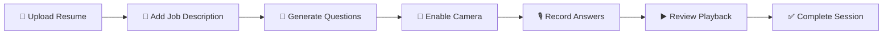

<div align="center">

# 🎤 AI Interview Pro

### *Your Personal AI-Powered Interview Coach*

[](https://fastapi.tiangolo.com/)
[](https://reactjs.org/)
[](https://www.typescriptlang.org/)
[](https://tailwindcss.com/)
[](https://www.python.org/)

*An intelligent interview preparation platform that generates personalized questions from your resume, records your answers, and monitors your performance using advanced computer vision.*

[Features](#-features) • [Tech Stack](#-tech-stack) • [Installation](#-installation) • [Usage](#-usage) • [Roadmap](#-roadmap)

</div>

---

## ✨ Features

<table>
<tr>
<td width="50%">

### 📄 Smart Resume Analysis
Upload your resume and let AI understand your experience and skills to generate targeted questions.

### 🧠 AI-Powered Questions
Leverages Google Gemini API to create personalized interview questions based on your resume and job description.

### 🎙️ Voice Recording
Browser-based audio recording with playback functionality for practicing your answers.

</td>
<td width="50%">

### 🎥 Live Proctoring
Real-time camera monitoring ensures authentic interview practice sessions.

### 👁️ Attention Tracking
Advanced YOLO + MediaPipe integration monitors attention, behavior, and engagement throughout the session.

### 📊 Session Analytics
Comprehensive alerts and summaries to help you improve your interview performance.

</td>
</tr>
</table>

---

## 🧱 Tech Stack

<div align="center">

### Frontend


**MediaRecorder API** for audio capture

### Backend


**Google Gemini API** • **Sentence Transformers** • **FAISS** • **YOLOv5** • **MediaPipe**

</div>

---

## 📂 Project Structure

```
AI-Interview-Prep/
│
├── 📁 backend/
│   ├── app.py                    # FastAPI entry point
│   ├── config.py                 # Configuration management
│   ├── schemas.py                # Pydantic models
│   ├── requirements.txt          # Python dependencies
│   ├── .env                      # Environment variables (create this)
│   │
│   ├── 📁 routes/                # API endpoints
│   ├── 📁 services/              # Business logic
│   ├── 📁 utils/                 # Helper functions
│   │
│   ├── 📁 models/
│   │   └── 📁 yolo/
│   │       └── yolov5s.pt       # YOLO model (download separately)
│   │
│   └── 📁 uploads/               # User uploaded files
│
├── 📁 frontend/                  # React application
│
└── README.md
```

---

## 🚀 Installation

### Prerequisites

- Python 3.8+
- Node.js 16+
- npm or yarn
- Git

### 1️⃣ Clone the Repository

```bash
git clone -b feature/harsh https://github.com/harshhrawte/AI-Interview-Prep.git
cd AI-Interview-Prep
```

---

## 🔧 Backend Setup

### 2️⃣ Create Virtual Environment

```bash
cd backend
python -m venv venv
```

**Activate the environment:**

<table>
<tr>
<td width="50%">

**Windows**
```bash
venv\Scripts\activate
```

</td>
<td width="50%">

**Mac/Linux**
```bash
source venv/bin/activate
```

</td>
</tr>
</table>

### 3️⃣ Install Dependencies

```bash
pip install -r requirements.txt
```

### 4️⃣ Setup YOLO Model ⚠️ IMPORTANT

**Create the models directory:**

```bash
mkdir -p backend/models/yolo
```

**Download YOLOv5s model:**

👉 [Download from Ultralytics Release](https://github.com/ultralytics/yolov5/releases/download/v7.0/yolov5s.pt)

**Place the file at:**
```
backend/models/yolo/yolov5s.pt
```

> ⚠️ **Note:** The backend does NOT auto-download models. This is intentional for production safety.

### 5️⃣ Configure Environment Variables

Create a `.env` file inside `backend/`:

```env
GEMINI_API_KEY=your_google_gemini_api_key_here
```

👉 Get your API key from: [Google AI Studio](https://aistudio.google.com/)

### 6️⃣ Run Backend Server

From the project root:

```bash
uvicorn backend.app:app --reload
```

*or*

```bash
python -m backend.app
```

✅ **Backend running at:** `http://localhost:8000`

---

## 🎨 Frontend Setup

```bash
cd frontend
npm install
npm run dev
```

✅ **Frontend running at:** `http://localhost:5173`

---

## 💡 Usage

<div align="center">

### Follow these simple steps to start your interview prep:

</div>



1. **Upload your resume** (PDF format)
2. **Paste job description** for the role you're targeting
3. **Generate personalized interview questions**
4. **Turn on camera** to begin proctoring
5. **Record your spoken answers**
6. **Play back and review** your responses
7. **Complete the interview session** and get insights

---

## 🧠 Design Philosophy

<table>
<tr>
<td>

### 🎯 Production-Grade Architecture
- Single, clean entry point (`app.py`)
- Modular structure with separation of concerns
- Environment-based configuration

</td>
<td>

### 🔒 Security & Performance
- Local YOLO model loading (no runtime downloads)
- Separate camera and microphone handling
- Browser-native audio encoding

</td>
</tr>
</table>

---

## 🗺️ Roadmap

<div align="center">

### Future Enhancements

</div>

| Feature | Status | Description |
|---------|--------|-------------|
| 🎯 Speech-to-Text Analysis | 🔜 Planned | Automatic transcription and analysis of spoken answers |
| 📊 Confidence Scoring | 🔜 Planned | AI-based confidence and filler-word detection |
| 🌊 Waveform Visualization | 🔜 Planned | Real-time audio waveform display during recording |
| 📈 Answer Scoring | 🔜 Planned | Intelligent feedback on answer quality and structure |
| 🐳 Docker Deployment | 🔜 Planned | Containerized application for easy deployment |
| 📱 Mobile Support | 💭 Future | Responsive design for mobile interview practice |

---

## 👨‍💻 Author

<div align="center">

**Harsh Rawte**

*Final Year B.Tech Student | AI Enthusiast*

[](https://github.com/harshhrawte)
[](https://linkedin.com/in/harshhrawte)

</div>

---

<div align="center">

### ⭐ If you found this project helpful, please consider giving it a star!

**Made with ❤️ and AI**

</div>
